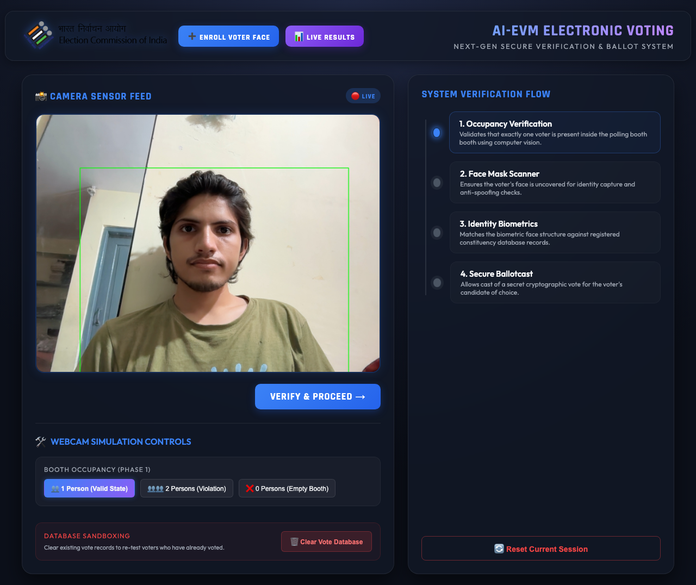
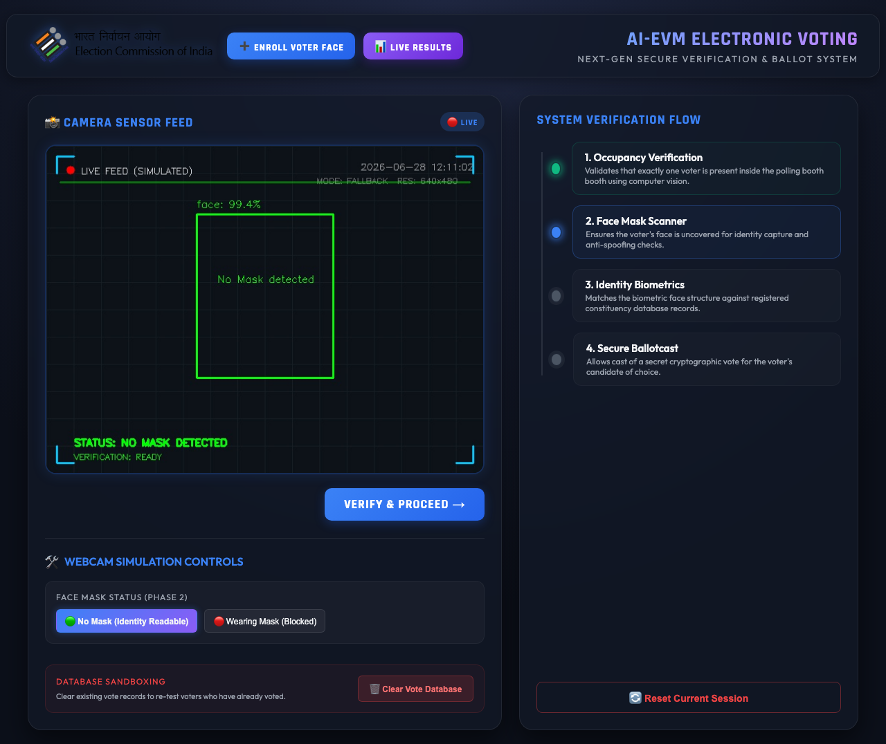
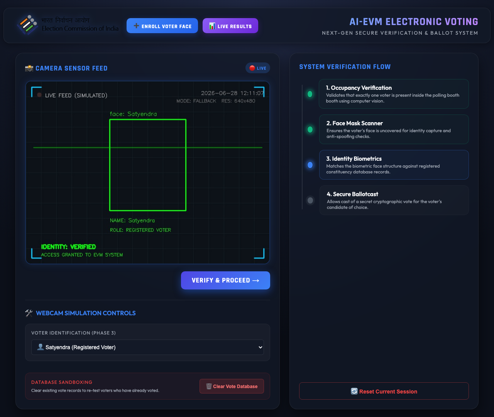
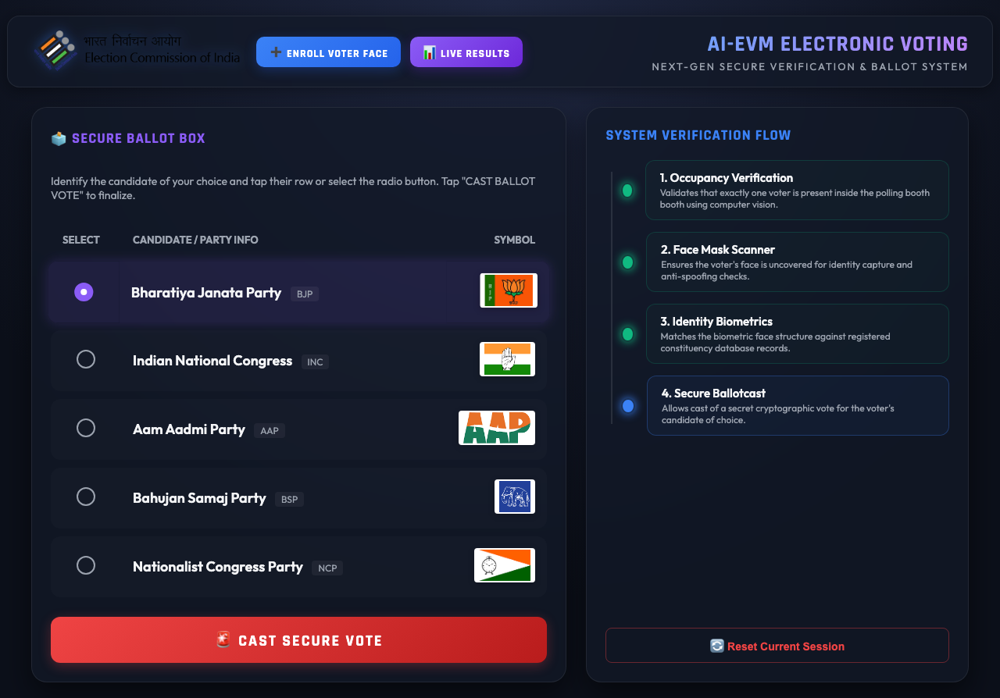
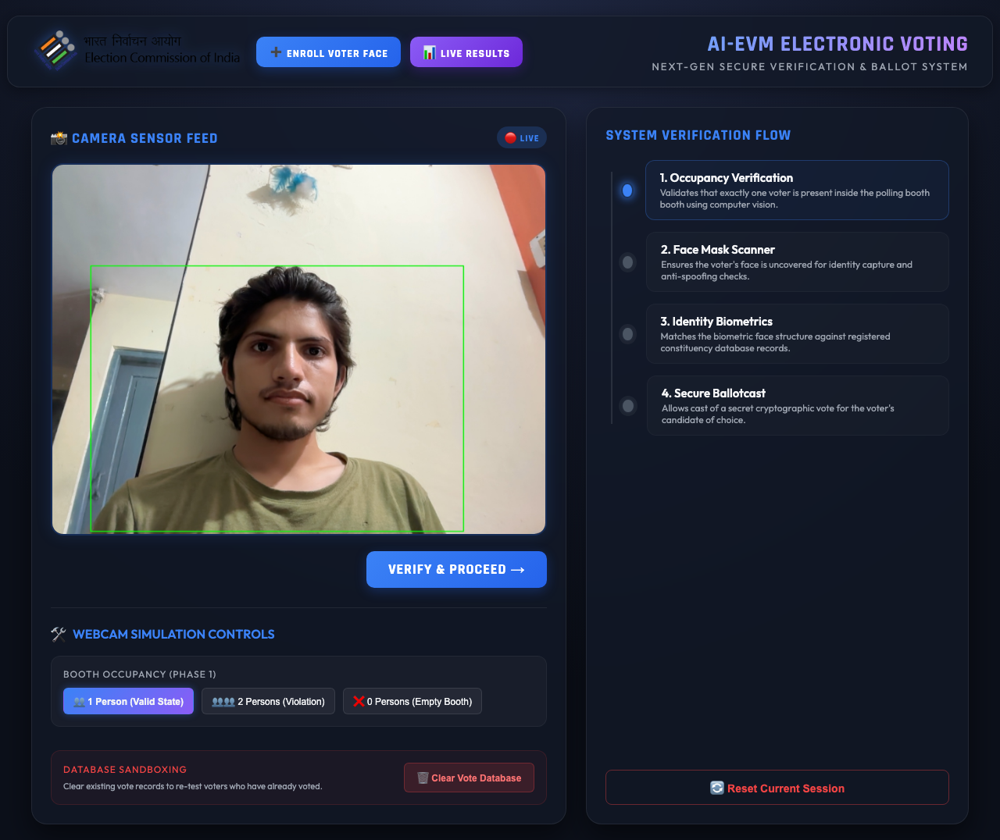
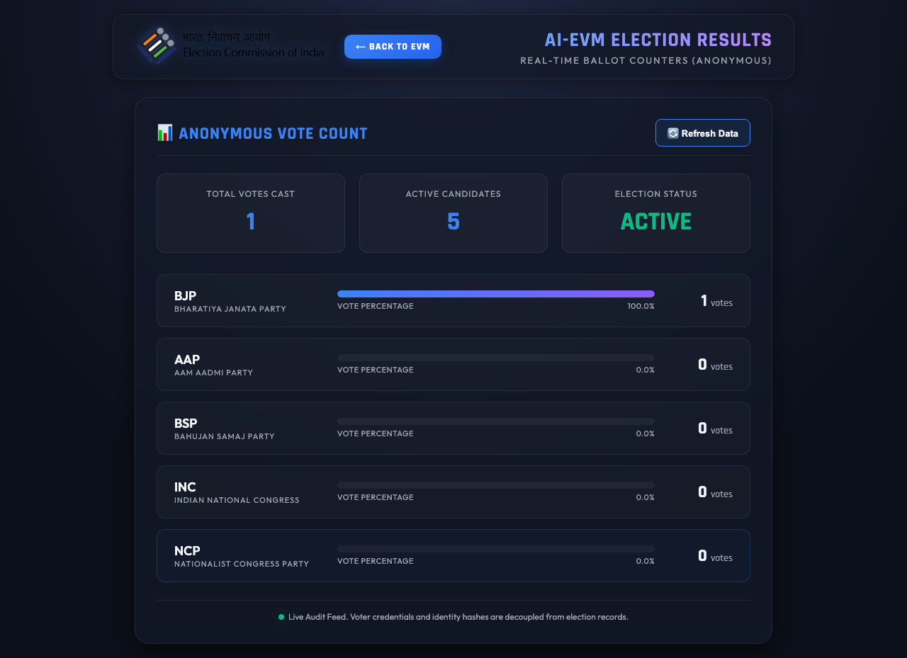
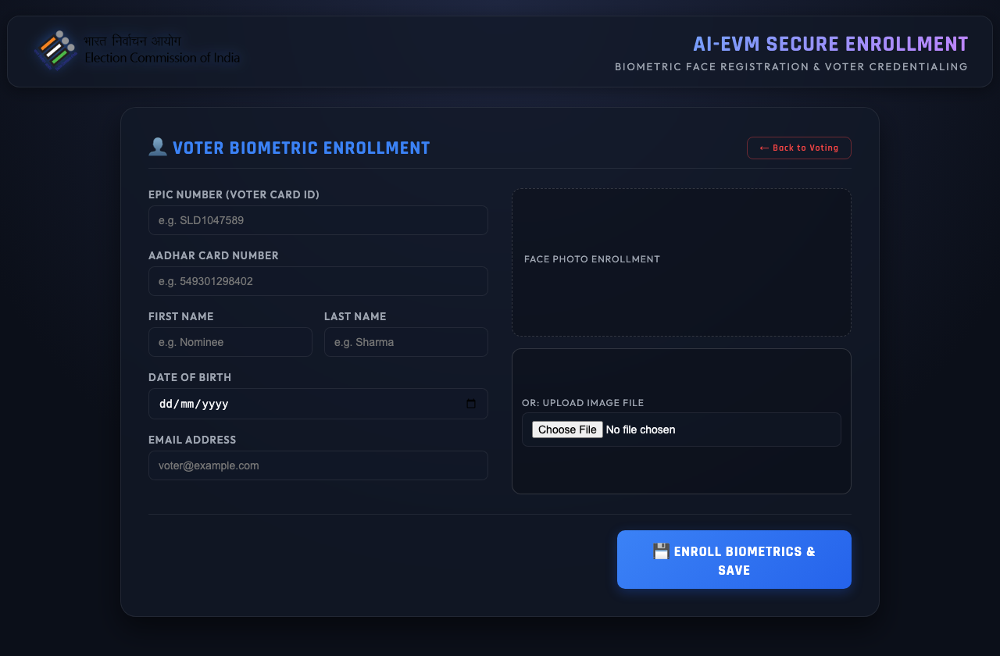

# AI-EVM: Project Working Snapshots & Step-by-Step Guide

This guide walks through the complete working flow of the **AI-Powered Electronic Voting Machine (AI-EVM)**. It details each of the 4 verification gates, the ballot casting step, live results, and voter enrollment.

---

### Step 1: Phase 1 - Person Detection (Booth Occupancy)
The first verification gate checks the number of individuals present in the voting booth to prevent multiple people from influencing a vote or performing proxy voting. 
* **Validation Rule**: Exactly **1 Person** must be detected.
* **Violation State**: If 0 people or 2+ people are detected, the system displays an error alert and blocks progress.
* **Simulator View**: The custom scanner HUD draws a green bounding box around the voter with a confidence metric.

---

### Step 2: Phase 2 - Mask Detection (Face Uncovering)
Once occupancy is verified, the system requires the voter to remove any face mask to allow visual identity checks.
* **Validation Rule**: Voter must **not** be wearing a mask.
* **Violation State**: If a mask is detected, a red bounding box and warning ("Please remove your mask...") will block the flow.
* **Verified State**: A green "No Mask" indicator confirms the face is fully visible and ready for recognition.

---

### Step 3: Phase 3 - Face Recognition (Identity Matching)
The system extracts biometric face landmarks and matches them against registered voter signatures stored in the constituency database.
* **Validation Rule**: The face must match a registered voter's profile signature.
* **Mock State**: Selecting a voter name (e.g., `Satyendra`) simulates a match, drawing a green box with the matched name and granting system access. Selecting `Unknown` locks the screen and triggers a rejection alert.

---

### Step 4: Secure Ballot Box (Ballot Casting)
Upon successful verification, the EVM terminal unlocks and presents the digital ballot sheet. The voter selects a political party of their choice (BJP, INC, AAP, BSP, NCP) by clicking their row, which activates the custom radio indicator.

---

### Step 5: Secure Vote Success
After clicking the **CAST SECURE VOTE** button, the system records the vote, triggers a confirmation sound, sends an automated confirmation email to the voter (via Mailjet API), flushes the session, and locks the terminal for the next voter.

---

### Step 6: Real-Time Live Results
Administrators and monitors can visit the **Live Results** page to view voter stats, party listings, and real-time vote count tallies represented on a clean analytics dashboard.

---

### Step 7: Voter Biometric Enrollment (Registration)
New voters can be enrolled in the constituency database at the `/register/` page. Administrators enter details (EPIC ID, Aadhar, Name, DOB, Email) and capture a face snapshot via their webcam (or upload an image file). The backend extracts face encodings and automatically updates the serialized face landmark database.

